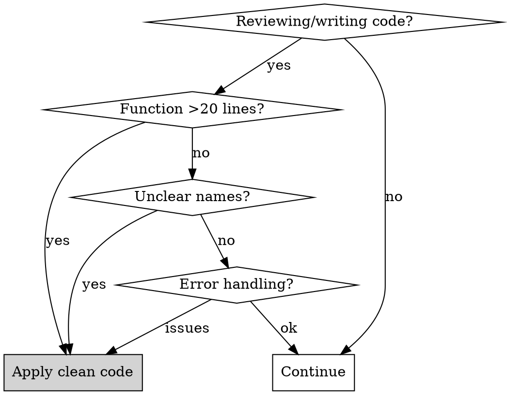

# Clean Code Principles

## Overview

**Code should be readable, maintainable, and self-documenting.**

Clean code isn't about perfection—it's about reducing cognitive load for the next reader (including your future self). Functions should do one thing, names should reveal intent, and error handling should be deliberate.

## When to Use



**Trigger symptoms:**
- Functions longer than 20-30 lines
- Names like `data`, `list`, `process`, `handler`, `x`, `temp`
- Try/catch blocks with just `console.log(e)`
- Conditions nested 3+ levels deep
- Methods with 5+ parameters
- Comments explaining WHAT code does (instead of WHY)

---

## Part I: Naming Conventions

**Names should reveal intent and be self-documenting.**

```typescript
// ❌ BAD: Unclear names
const d = new Date();
const list = getItems();
function process(x) { ... }
function handle(data) { ... }

// ✅ GOOD: Intention-revealing names
const orderCreatedAt = new Date();
const activeCustomers = getActiveCustomers();
function calculateOrderTotal(order) { ... }
function validateUserCredentials(credentials) { ... }
```

### Naming Rules

| Type | Convention | Example |
|------|------------|---------|
| Boolean | `is`, `has`, `can`, `should` prefix | `isActive`, `hasPermission`, `canDelete` |
| Function | Verb + noun | `calculateTotal`, `validateEmail`, `sendNotification` |
| Collection | Plural noun | `users`, `orderItems`, `validEmails` |
| Constants | SCREAMING_SNAKE_CASE | `MAX_RETRY_COUNT`, `DEFAULT_TIMEOUT_MS` |
| Classes | PascalCase noun | `OrderProcessor`, `UserValidator` |

### Avoid Meaningless Names

```typescript
// ❌ These reveal nothing
const data = fetch();
const result = process(data);
const info = getInfo();
const temp = calculate();

// ✅ Be specific
const userProfile = fetchUserProfile();
const validatedOrder = validateOrder(rawOrder);
const shippingCost = calculateShippingCost();
```

---

## Part II: Function Size (Single Responsibility)

**Functions should do one thing and be small (<20 lines ideal).**

```typescript
// ❌ BAD: Function does too much (violation of SRP)
function processOrder(order) {
  // Validate order (10 lines)
  if (!order.items) throw new Error('No items');
  if (order.items.length === 0) throw new Error('Empty order');
  // ... more validation

  // Calculate totals (15 lines)
  let total = 0;
  for (const item of order.items) {
    total += item.price * item.quantity;
  }
  // ... apply taxes, fees

  // Apply discounts (10 lines)
  if (order.coupon) {
    total = total * (1 - order.coupon.discount);
  }
  // ... more discount logic

  // Send notifications (10 lines)
  sendEmail(order.customer.email, 'Order confirmed');
  // ... more notifications

  // Update inventory (10 lines)
  for (const item of order.items) {
    decrementStock(item.productId, item.quantity);
  }
}

// ✅ GOOD: Small, focused functions
function processOrder(order) {
  validateOrder(order);
  const subtotal = calculateSubtotal(order);
  const total = applyDiscounts(order, subtotal);
  notifyCustomer(order);
  updateInventory(order);
  return { total };
}

function validateOrder(order) {
  if (!order.items?.length) {
    throw new InvalidOrderError('Order must have items');
  }
}

function calculateSubtotal(order) {
  return order.items.reduce(
    (sum, item) => sum + item.price * item.quantity,
    0
  );
}
```

### Function Length Guidelines

| Lines | Assessment | Action |
|-------|------------|--------|
| 1-10 | Excellent | Keep as is |
| 11-20 | Good | Acceptable |
| 21-30 | Questionable | Consider splitting |
| 31-50 | Too long | Split into smaller functions |
| 50+ | Critical | Must refactor |

---

## Part III: SOLID Principles

### S - Single Responsibility Principle

**One class/function = one reason to change.**

```typescript
// ❌ BAD: Class has multiple responsibilities
class UserService {
  createUser(data) { ... }
  sendWelcomeEmail(user) { ... }      // Email responsibility
  generateReport(users) { ... }       // Reporting responsibility
  validatePassword(password) { ... }  // Validation responsibility
}

// ✅ GOOD: Separated responsibilities
class UserService {
  createUser(data) { ... }
}

class EmailService {
  sendWelcomeEmail(user) { ... }
}

class UserReportGenerator {
  generateReport(users) { ... }
}

class PasswordValidator {
  validate(password) { ... }
}
```

### O - Open/Closed Principle

**Open for extension, closed for modification.**

```typescript
// ❌ BAD: Must modify class for new payment types
class PaymentProcessor {
  process(payment) {
    if (payment.type === 'credit') { ... }
    else if (payment.type === 'paypal') { ... }
    else if (payment.type === 'crypto') { ... }  // Keep adding
  }
}

// ✅ GOOD: Extensible via new classes
interface PaymentHandler {
  canHandle(payment): boolean;
  process(payment): void;
}

class PaymentProcessor {
  constructor(private handlers: PaymentHandler[]) {}

  process(payment) {
    const handler = this.handlers.find(h => h.canHandle(payment));
    if (!handler) throw new UnsupportedPaymentError();
    return handler.process(payment);
  }
}
```

### L - Liskov Substitution Principle

**Subtypes must be substitutable for their base types.**

```typescript
// ❌ BAD: Square violates Rectangle contract
class Rectangle {
  setWidth(w) { this.width = w; }
  setHeight(h) { this.height = h; }
}

class Square extends Rectangle {
  setWidth(w) { this.width = this.height = w; }  // Unexpected behavior
}

// ✅ GOOD: Separate types with correct contracts
interface Shape {
  getArea(): number;
}

class Rectangle implements Shape { ... }
class Square implements Shape { ... }
```

### I - Interface Segregation Principle

**Many specific interfaces > one general interface.**

```typescript
// ❌ BAD: Fat interface
interface Worker {
  work();
  eat();
  sleep();
  attendMeeting();
}

// ✅ GOOD: Segregated interfaces
interface Workable { work(); }
interface Eatable { eat(); }
interface Meetable { attendMeeting(); }

class Developer implements Workable, Eatable, Meetable { ... }
class Robot implements Workable { ... }  // Robots don't eat or meet
```

### D - Dependency Inversion Principle

**Depend on abstractions, not concrete implementations.**

```typescript
// ❌ BAD: Direct dependency on concrete class
class OrderService {
  private db = new MySQLDatabase();  // Tight coupling

  saveOrder(order) {
    this.db.insert('orders', order);
  }
}

// ✅ GOOD: Depend on abstraction
interface Database {
  insert(table: string, data: object): void;
}

class OrderService {
  constructor(private db: Database) {}  // Injected abstraction

  saveOrder(order) {
    this.db.insert('orders', order);
  }
}
```

---

## Part IV: Code Smells

| Smell | Description | Solution |
|-------|-------------|----------|
| Long Method | >20 lines, multiple responsibilities | Extract methods |
| Long Parameter List | >3-4 parameters | Use parameter object |
| Feature Envy | Method uses another class's data more than its own | Move method to that class |
| God Class | Class that knows/does too much | Split into focused classes |
| Primitive Obsession | Using primitives instead of small objects | Create value objects |
| Duplicate Code | Same logic in multiple places | Extract to shared function |
| Dead Code | Unused code left in codebase | Delete it |
| Comments | Explaining WHAT instead of WHY | Rename or restructure |

### Long Parameter List

```typescript
// ❌ BAD: Too many parameters
function createUser(
  name, email, age, address, city, country, phone, isAdmin, department
) { ... }

// ✅ GOOD: Use parameter object
interface CreateUserParams {
  name: string;
  email: string;
  age: number;
  address: Address;
  phone: string;
  role: UserRole;
}

function createUser(params: CreateUserParams) { ... }
```

### Feature Envy

```typescript
// ❌ BAD: Method envies Order's data
class InvoiceGenerator {
  generateTotal(order) {
    return order.items
      .filter(i => !i.cancelled)
      .reduce((sum, i) => sum + i.price * i.quantity, 0)
      * (1 - order.discount);
  }
}

// ✅ GOOD: Logic belongs in Order
class Order {
  calculateTotal() {
    return this.activeItems
      .reduce((sum, i) => sum + i.getSubtotal(), 0)
      .applyDiscount(this.discount);
  }
}
```

---

## Part V: Error Handling

**Handle errors deliberately, not generically.**

```typescript
// ❌ BAD: Swallowing errors
try {
  await processPayment();
} catch (e) {
  console.log(e);  // Error swallowed, user sees nothing
}

// ❌ BAD: Generic catch
try {
  await processPayment();
} catch (e) {
  throw new Error('Payment failed');  // Lost context
}

// ✅ GOOD: Specific handling, proper propagation
try {
  await processPayment();
} catch (error) {
  if (error instanceof PaymentDeclinedError) {
    return { success: false, reason: 'payment_declined' };
  }
  if (error instanceof InsufficientFundsError) {
    return { success: false, reason: 'insufficient_funds' };
  }
  // Re-throw unexpected errors
  throw error;
}
```

### Error Handling Rules

| Practice | Do | Don't |
|----------|-----|-------|
| Catch scope | Specific exceptions | Catch all |
| Error info | Preserve stack trace | Swallow context |
| Recovery | Handle what you can recover from | Catch and ignore |
| Propagation | Re-throw unexpected errors | Silent failures |
| Logging | Log with context | Just `console.log(e)` |

---

## Part VI: Comments

**Good code is self-documenting. Comments explain WHY, not WHAT.**

```typescript
// ❌ BAD: Comments explain WHAT (redundant)
// Loop through items and add prices
for (const item of items) {
  total += item.price;
}

// ❌ BAD: Comment compensates for bad naming
// Check if user can access admin panel
if (u.r === 1) { ... }

// ✅ GOOD: Self-documenting code, no comment needed
for (const item of items) {
  orderTotal += item.price;
}

// ✅ GOOD: Comment explains WHY (business rule)
// VAT is calculated at checkout, not here, per finance requirement FR-2341
const subtotal = items.reduce((sum, i) => sum + i.price, 0);

// ✅ GOOD: Comment explains non-obvious decision
// Using insertion sort here because arrays are typically <10 items
// and insertion sort outperforms quicksort for small n
insertionSort(items);
```

### When Comments Are Appropriate

| Appropriate | Inappropriate |
|-------------|---------------|
| Business rules not obvious from code | Explaining what code does |
| Legal/compliance requirements | Compensating for bad names |
| Warning of consequences | Commented-out code |
| Explaining "why" for non-obvious decisions | TODOs without context |
| API documentation (JSDoc) | Redundant information |

---

## Quick Reference

| Symptom | Problem | Fix |
|---------|---------|-----|
| Function >20 lines | Too many responsibilities | Extract smaller functions |
| Parameters >4 | Too many inputs | Use parameter object |
| `data`, `result`, `temp` | Unclear naming | Use descriptive names |
| `catch (e) { console.log(e) }` | Error swallowing | Handle or re-throw |
| Comment explains WHAT | Poor naming/structure | Rename or refactor |
| Nesting >3 levels | Complex conditions | Extract methods, early returns |
| Class >200 lines | God class | Split responsibilities |

## Severity Guide

| Level | Indicators | Action |
|-------|------------|--------|
| CRITICAL | God class, serious SRP violation, error swallowing | Must fix before merge |
| HIGH | Long methods (>50 lines), >5 parameters, feature envy | Should fix |
| MEDIUM | Methods 20-50 lines, unclear naming, minor SOLID issues | Consider fixing |
| LOW | Style improvements, documentation opportunities | Optional |

## Red Flags - Stop and Refactor

| You're about to... | Stop and ask... |
|-------------------|-----------------|
| Add 5th parameter | Should I use a parameter object? |
| Add 30th line to function | Should I extract a method? |
| Name variable `data` or `result` | What does this actually represent? |
| Write `catch (e) { }` | What should happen on error? |
| Write comment explaining code | Can I rename to make it obvious? |
| Nest 4th level of conditions | Can I use early returns or extract? |

## Common Rationalizations

| Excuse | Reality |
|--------|---------|
| "It's just a small function" | Small today, large tomorrow |
| "The name is obvious in context" | Context changes, readers differ |
| "I'll refactor later" | Later never comes |
| "It's just logging the error" | Silent failures cause production incidents |
| "Comments make it clearer" | Good names and structure make it clearer |
| "It's only 25 lines" | Each line over 20 adds cognitive load |
| "Breaking it up adds overhead" | Function call overhead is negligible |
