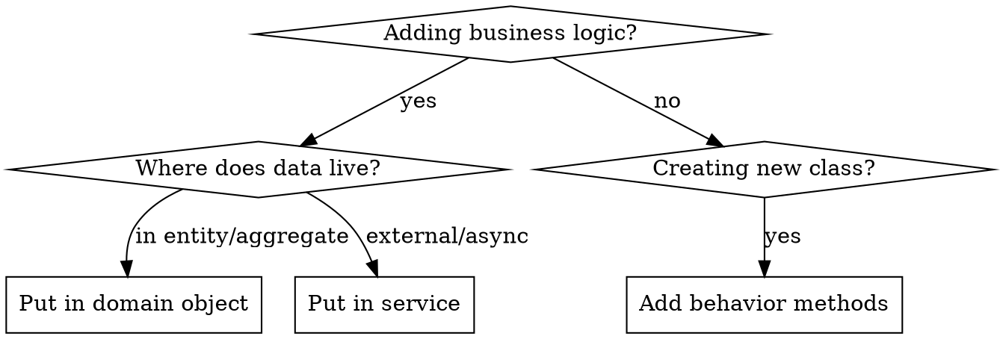

# Domain-Driven Design & Object-Oriented Programming

## Overview

**Domain objects are business logic owners, NOT data containers.**

The fundamental principle from Eric Evans: behavior belongs with the data it operates on. When you extract data from an object to calculate something elsewhere, you've violated encapsulation and created what Martin Fowler calls an "Anemic Domain Model" - an anti-pattern.

> "The basic symptom of an Anemic Domain Model is that at first blush it looks like the real thing... but when you look at the behavior, you realize there is hardly any behavior on these objects." — Martin Fowler

## When to Use



**Use this skill when:**
- Designing new domain models or entities
- Adding calculations or business rules
- Reviewing code with services that have many parameters
- Deciding if logic belongs in domain object or service
- Defining aggregate boundaries

**Don't use for:**
- Pure infrastructure code (HTTP handlers, DB adapters)
- Simple CRUD without business logic
- External API integrations

---

## Part I: Strategic DDD

### Ubiquitous Language

> "Use the model as the backbone of a language... Commit the team to exercising that language relentlessly in all communication within the team and in the code." — Eric Evans

**The language in code must match the language domain experts use.**

```typescript
// ✅ GOOD: Uses domain language
class Aquarium {
  stockFish(fish: Fish): void { ... }
  performWaterChange(percentage: Percentage): void { ... }
  cycleCompleted(): boolean { ... }
}

// ❌ BAD: Technical/generic language
class Aquarium {
  addItem(item: Item): void { ... }
  updateValue(field: string, value: number): void { ... }
  checkFlag(): boolean { ... }
}
```

### Bounded Contexts

A Bounded Context is a semantic boundary where a particular domain model applies. The same word can mean different things in different contexts.

```typescript
// Sales Context: Customer has payment info, purchase history
class Customer {
  creditLimit: Money;
  paymentMethod: PaymentMethod;
  calculateLifetimeValue(): Money { ... }
}

// Support Context: Customer has tickets, satisfaction score
class Customer {
  openTickets: Ticket[];
  satisfactionScore: number;
  escalate(): void { ... }
}
```

**Rule:** Don't try to create one unified model. Embrace context boundaries.

---

## Part II: Tactical DDD Building Blocks

### Entities vs Value Objects

| Aspect | Entity | Value Object |
|--------|--------|--------------|
| Identity | Has unique ID | Identified by attributes |
| Mutability | Can change state | Immutable |
| Lifecycle | Tracked over time | Replaceable |
| Equality | By ID | By value |

```typescript
// ENTITY: Identity matters, tracked over time
class Fish {
  constructor(
    private readonly id: FishId,
    private name: string,
    private species: Species
  ) {}

  equals(other: Fish): boolean {
    return this.id.equals(other.id);  // Identity comparison
  }

  rename(newName: string): void {
    this.name = newName;  // State can change
  }
}

// VALUE OBJECT: Immutable, equality by attributes
class Temperature {
  private constructor(
    private readonly value: number,
    private readonly unit: TemperatureUnit
  ) {
    this.validate();
  }

  static celsius(value: number): Temperature {
    return new Temperature(value, TemperatureUnit.Celsius);
  }

  equals(other: Temperature): boolean {
    return this.toCelsius() === other.toCelsius();  // Value comparison
  }

  add(delta: Temperature): Temperature {
    return Temperature.celsius(this.toCelsius() + delta.toCelsius());
  }

  private validate(): void {
    if (this.toCelsius() < -273.15) {
      throw new DomainError('Temperature below absolute zero');
    }
  }
}
```

**Value Object Benefits (from Evans):**
- Immutability eliminates aliasing bugs
- Safe to share between entities
- Easy to test (no mocking needed)
- Self-validating

### Aggregates

> "An Aggregate is a cluster of associated objects that we treat as a unit for the purpose of data changes." — Eric Evans

**Aggregate Design Rules (from Vaughn Vernon):**

1. **Protect business invariants inside Aggregate boundaries**
2. **Design small Aggregates**
3. **Reference other Aggregates by identity only**
4. **Update other Aggregates using eventual consistency**

```typescript
// ✅ GOOD: Small aggregate, references by ID
class Order {
  private readonly id: OrderId;
  private readonly customerId: CustomerId;  // Reference by ID, not object
  private items: OrderItem[];
  private status: OrderStatus;

  // Invariant: Order total cannot exceed customer credit (checked at application layer)
  // Invariant: Cannot add items to confirmed order (protected here)
  addItem(productId: ProductId, quantity: Quantity, price: Money): void {
    this.assertNotConfirmed();
    this.items.push(new OrderItem(productId, quantity, price));
  }

  confirm(): void {
    this.assertHasItems();
    this.status = OrderStatus.Confirmed;
    this.apply(new OrderConfirmedEvent(this.id));  // Domain event
  }

  private assertNotConfirmed(): void {
    if (this.status !== OrderStatus.Draft) {
      throw new DomainError('Cannot modify confirmed order');
    }
  }
}

// ❌ BAD: Large aggregate with object references
class Order {
  customer: Customer;        // Full object = large transaction boundary
  products: Product[];       // Loading entire product catalog
  warehouse: Warehouse;      // Unrelated aggregate
}
```

**Why small aggregates?**
- Smaller transaction boundaries = better concurrency
- Easier to maintain invariants
- Clearer responsibilities

### Domain Events

> "Something happened that domain experts care about." — Eric Evans

Domain Events capture facts about what occurred in the domain.

```typescript
class Aquarium extends AggregateRoot {
  private waterParameters: WaterParameters;

  recordMeasurement(params: WaterParameters): void {
    const previousParams = this.waterParameters;
    this.waterParameters = params;

    // Publish what happened, not what to do
    this.apply(new WaterParametersRecordedEvent(
      this.id,
      params,
      previousParams
    ));

    if (params.ammonia.isAbove(SafeLevel.AMMONIA)) {
      this.apply(new DangerousAmmoniaDetectedEvent(this.id, params.ammonia));
    }
  }
}

// Handler reacts to event (in different aggregate/service)
class NotificationHandler {
  handle(event: DangerousAmmoniaDetectedEvent): void {
    this.notificationService.alertUser(event.aquariumId, 'High ammonia detected!');
  }
}
```

**Event naming:** Past tense, describes what happened (`OrderConfirmed`, `FishAdded`), not commands (`ConfirmOrder`).

---

## Part III: Core OOP Principles

### 1. Rich Domain Models vs Anemic Models

| Aspect | Rich Model (DO) | Anemic Model (DON'T) |
|--------|-----------------|----------------------|
| Data | Private/protected | Public/exposed |
| Behavior | Methods on entity | Methods in services |
| Validation | In constructor/methods | In services/DTOs only |
| State changes | Via domain methods | Direct property assignment |

```typescript
// ✅ RICH: Domain object owns behavior
class Order {
  private items: OrderItem[];
  private status: OrderStatus;

  addItem(product: Product, quantity: number): void {
    if (this.status !== OrderStatus.Draft) {
      throw new DomainError('Cannot modify confirmed order');
    }
    this.items.push(new OrderItem(product, quantity));
  }

  getTotal(): Money {
    return this.items.reduce(
      (sum, item) => sum.add(item.getSubtotal()),
      Money.zero()
    );
  }

  confirm(): void {
    if (this.items.length === 0) {
      throw new DomainError('Cannot confirm empty order');
    }
    this.status = OrderStatus.Confirmed;
  }
}

// ❌ ANEMIC: Data container + logic in service
class Order {
  items: OrderItem[];  // Public data
  status: string;      // Primitive, no protection
}

class OrderService {
  addItem(order: Order, product: Product, qty: number): void {
    if (order.status !== 'draft') throw new Error('...');
    order.items.push({ product, qty });  // Direct manipulation
  }

  calculateTotal(order: Order): number {
    return order.items.reduce((sum, i) => sum + i.price * i.qty, 0);
  }
}
```

### 2. Tell, Don't Ask (Law of Demeter)

> "Only talk to your immediate friends." — Karl Lieberherr

**Tell objects what you need, don't ask for data and decide yourself.**

```typescript
// ✅ TELL: Ask domain object to do its job
const hasInvertebrates = aquarium.hasInvertebrates();
const canAddFish = tank.canAccommodate(newFish);
const discount = customer.calculateDiscount(order);

// ❌ ASK: Extract data and decide externally (Law of Demeter violation)
const hasInvertebrates = aquarium.animals
  .filter(a => !a.removedAt)
  .some(a => INVERTEBRATE_TYPES.includes(a.type));

// ❌ TRAIN WRECK: Chaining through object graph
const city = order.getCustomer().getAddress().getCity();
```

### 3. Command-Query Separation (CQS)

> "Asking a question should not change the answer." — Bertrand Meyer

```typescript
class Account {
  // ✅ QUERY: Returns data, no side effects
  getBalance(): Money {
    return this.balance;
  }

  // ✅ COMMAND: Changes state, returns void
  withdraw(amount: Money): void {
    this.assertSufficientFunds(amount);
    this.balance = this.balance.subtract(amount);
  }

  // ❌ BAD: Mixed command and query
  withdrawAndReturnBalance(amount: Money): Money {
    this.balance = this.balance.subtract(amount);
    return this.balance;  // Side effect + return = confusing
  }
}
```

### 4. Design by Contract (DbC)

> "A contract specifies mutual obligations: what the client must provide and what the supplier guarantees." — Bertrand Meyer

```typescript
class BankAccount {
  /**
   * Withdraws money from account.
   *
   * @precondition amount > 0
   * @precondition amount <= this.balance
   * @postcondition this.balance === old(this.balance) - amount
   * @throws InsufficientFundsError if preconditions not met
   */
  withdraw(amount: Money): void {
    // Precondition checks (guard clauses)
    if (amount.isNegativeOrZero()) {
      throw new DomainError('Amount must be positive');
    }
    if (amount.isGreaterThan(this.balance)) {
      throw new InsufficientFundsError(this.balance, amount);
    }

    // Core logic
    this.balance = this.balance.subtract(amount);

    // Postcondition (invariant) could be asserted in tests
  }
}
```

### 5. Pass Domain Objects, Not Primitives

> "Don't let the interface of a class reveal anything about its implementation." — Gang of Four

**Reduce parameters by passing rich objects that encapsulate related data and behavior.**

```typescript
// ✅ GOOD: Rich domain objects with behavior
interface StatusCalculationInput {
  aquarium: Aquarium;                    // Has type, size, etc.
  animalHistory: AquariumAnimalHistory;  // Has hasInvertebrates()
  plantHistory: AquariumPlantHistory;    // Has hasHighDemandPlants()
  referenceDate: Date;
}

service.calculate(input);  // 4 parameters

// ❌ BAD: Primitive obsession
service.calculate(
  aquariumId,           // Could get from aquarium
  aquariumType,         // Could get from aquarium
  animals,              // Raw data, no behavior
  hasInvertebrates,     // Pre-calculated flag
  shrimpType,           // Pre-calculated value
  plants,               // Raw data
  hasHighDemandPlants,  // Pre-calculated flag
  referenceDate
);  // 8+ parameters - a code smell
```

### 6. Invariants as Non-Nullable Fields

**If data always exists together, make it non-nullable. Document the contract in types.**

```typescript
// ✅ GOOD: Strong contract - data that exists together is required
interface AquariumWithHistory {
  aquarium: Aquarium;                    // Required
  animalHistory: AquariumAnimalHistory;  // Required - created with aquarium
  plantHistory: AquariumPlantHistory;    // Required - created with aquarium
  settings: AquariumSettings;            // Required - created with aquarium
}

// ❌ BAD: Weak contract - everything optional
interface AquariumData {
  aquariumId?: number;
  aquariumType?: string | null;
  animalHistory?: Animal[] | null;
  plantHistory?: Plant[] | null;
}

// Result: defensive null checks everywhere
if (data.animalHistory && data.aquariumType) { ... }
```

---

## Part IV: Factories & Specifications

### Factory Pattern

> "When creation of an object becomes complicated or reveals too much of the internal structure, Factories provide encapsulation." — Eric Evans

```typescript
// ✅ FACTORY: Encapsulates complex creation logic
class AquariumFactory {
  create(params: CreateAquariumParams): Aquarium {
    const aquarium = new Aquarium(
      AquariumId.generate(),
      params.name,
      params.type
    );

    // Factory ensures all invariants are satisfied at creation
    const defaultSettings = this.createDefaultSettings(params.type);
    aquarium.applySettings(defaultSettings);

    // Creates related entities together
    const emptyHistory = AquariumHistory.empty(aquarium.id);

    return aquarium;
  }

  private createDefaultSettings(type: AquariumType): AquariumSettings {
    // Complex logic to determine defaults based on type
    return type === AquariumType.Marine
      ? MarineDefaults.create()
      : FreshwaterDefaults.create();
  }
}

// ❌ BAD: Creation logic scattered in services
class AquariumService {
  create(params: CreateParams): Aquarium {
    const aquarium = new Aquarium();
    aquarium.id = generateId();  // Direct property access
    aquarium.name = params.name;
    aquarium.settings = this.settingsService.getDefaults(params.type);
    // Easy to forget steps, invariants not protected
    return aquarium;
  }
}
```

### Specification Pattern

> "A Specification states a constraint on the state of another object." — Eric Evans

```typescript
// ✅ SPECIFICATION: Encapsulates business rules
interface Specification<T> {
  isSatisfiedBy(candidate: T): boolean;
  and(other: Specification<T>): Specification<T>;
  or(other: Specification<T>): Specification<T>;
  not(): Specification<T>;
}

class HighDemandPlantSpecification implements Specification<Plant> {
  isSatisfiedBy(plant: Plant): boolean {
    return plant.co2Requirement === CO2Requirement.High ||
           plant.lightRequirement === LightRequirement.High;
  }
}

class InvertebrateSpecification implements Specification<Animal> {
  private readonly invertebrateTypes = [
    AnimalType.Shrimp,
    AnimalType.Snail,
    AnimalType.Crab
  ];

  isSatisfiedBy(animal: Animal): boolean {
    return this.invertebrateTypes.includes(animal.type);
  }
}

// Usage in domain
class AquariumPlantHistory {
  hasHighDemandPlants(): boolean {
    const spec = new HighDemandPlantSpecification();
    return this.activePlants.some(plant => spec.isSatisfiedBy(plant));
  }
}

// Composable specifications
const premiumCustomer = new HighValueSpecification()
  .and(new LongTermSpecification())
  .and(new GoodPaymentHistorySpecification().not().not());  // Double negation = itself
```

---

## Part V: Services

### Domain Services vs Application Services

| Aspect | Domain Service | Application Service |
|--------|---------------|---------------------|
| Contains | Business logic without natural home | Use case orchestration |
| Dependencies | Only domain objects | Repositories, external services |
| State | Stateless | Stateless |
| Transactions | Unaware | Manages transactions |

```typescript
// DOMAIN SERVICE: Business logic that doesn't belong to single entity
class WaterCompatibilityService {
  // Pure domain logic, no I/O
  checkCompatibility(
    fish: Fish[],
    plants: Plant[],
    waterParams: WaterParameters
  ): CompatibilityReport {
    const issues: CompatibilityIssue[] = [];

    for (const f of fish) {
      if (!f.tolerates(waterParams.temperature)) {
        issues.push(new TemperatureIncompatibility(f, waterParams.temperature));
      }
    }

    return new CompatibilityReport(issues);
  }
}

// APPLICATION SERVICE: Orchestrates use case, handles I/O
class AddFishToAquariumUseCase {
  constructor(
    private readonly aquariumRepo: AquariumRepository,
    private readonly compatibilityService: WaterCompatibilityService
  ) {}

  async execute(aquariumId: AquariumId, fishToAdd: Fish): Promise<void> {
    // 1. Load aggregate
    const aquarium = await this.aquariumRepo.findById(aquariumId);

    // 2. Use domain service for cross-entity logic
    const report = this.compatibilityService.checkCompatibility(
      [...aquarium.fish, fishToAdd],
      aquarium.plants,
      aquarium.currentWaterParams
    );

    if (report.hasBlockingIssues()) {
      throw new IncompatibleFishError(report);
    }

    // 3. Domain logic in aggregate
    aquarium.addFish(fishToAdd);

    // 4. Persist
    await this.aquariumRepo.save(aquarium);
  }
}
```

### When Logic Stays in Services

**Services are appropriate for:**

1. **Stateless domain logic** that doesn't belong to a single entity
2. **Cross-aggregate operations** (but consider domain events instead)
3. **External system integration** (wrapped in anti-corruption layer)
4. **Use case orchestration** (application services)

```typescript
// ✅ Appropriate: Cross-entity domain logic
class TaxCalculationService {
  calculate(order: Order, customer: Customer, jurisdiction: Jurisdiction): Tax {
    // Complex tax logic involving multiple entities
  }
}

// ✅ Appropriate: Application orchestration with I/O
class OrderFulfillmentService {
  async fulfill(orderId: OrderId): Promise<void> {
    const order = await this.orderRepo.findById(orderId);
    const inventory = await this.inventoryRepo.findForProducts(order.productIds);

    order.markAsFulfilling();           // Domain logic in entity
    inventory.reserve(order.items);     // Domain logic in entity

    await this.orderRepo.save(order);
    await this.inventoryRepo.save(inventory);
  }
}
```

---

## Part VI: Repository Pattern

> "A Repository represents all objects of a certain type as a conceptual set." — Eric Evans

```typescript
// ✅ REPOSITORY: Collection-like interface, hides persistence details
interface AquariumRepository {
  findById(id: AquariumId): Promise<Aquarium | null>;
  findByOwner(ownerId: UserId): Promise<Aquarium[]>;
  save(aquarium: Aquarium): Promise<void>;
  remove(aquarium: Aquarium): Promise<void>;

  // Domain-specific queries
  findRequiringMaintenance(before: Date): Promise<Aquarium[]>;
}

// ❌ BAD: Generic repository (violates DDD principles)
interface Repository<T> {
  find(conditions: Partial<T>): Promise<T[]>;
  findOne(conditions: Partial<T>): Promise<T | null>;
  save(entity: T): Promise<void>;
}
```

**Repository Rules:**
- One repository per aggregate root
- Returns fully reconstituted domain objects, not database entities
- Encapsulates query logic
- Named with domain language (`findRequiringMaintenance`, not `findByMaintenanceDateLessThan`)

---

## Quick Reference

| Symptom | Problem | Solution |
|---------|---------|----------|
| Service has 6+ parameters | Anemic model | Move logic to domain objects |
| `entity.data.filter(...).some(...)` | Tell Don't Ask violation | Add method to entity |
| `if (x) { ... } else if (y) { ... }` in service | Logic belongs in domain | Move to domain method |
| `field?: Type \| null` for always-present data | Weak invariants | Make non-nullable |
| `XxxCalculationService` | Calculation belongs in entity | Move to domain method |
| Passing `id, type, name` separately | Primitive obsession | Pass domain object or Value Object |
| Aggregate references full objects | Large transaction boundaries | Reference by ID |
| Same word means different things | Missing bounded context | Define explicit contexts |

## Red Flags - Stop and Reconsider

| You're about to... | Stop and ask... |
|-------------------|-----------------|
| Create `XxxCalculationService` | Can this be a method on the entity that owns the data? |
| Add 6th parameter to service method | Should I pass domain objects instead? |
| Write `entity.field.filter(...).map(...)` | Should entity have a method for this? |
| Make field nullable | Is this data always created with parent? |
| Extract data from entity for calculation | Should calculation live in entity? |
| Create universal `Repository.find(conditions)` | Should I create specific finder methods? |
| Reference another aggregate by object | Should I reference by ID instead? |

## Common Mistakes & Rebuttals

### 1. "Services are easier to test"

**Reality:** Rich domain objects are easier to test - pure functions, no mocks needed.

```typescript
// ✅ Easy to test: pure domain logic
test('order calculates total correctly', () => {
  const order = new Order();
  order.addItem(product, 2);
  expect(order.getTotal()).toEqual(Money.of(200, 'USD'));
});

// ❌ Harder to test: service with dependencies
test('service calculates total', () => {
  const mockRepo = mock<OrderRepository>();
  const service = new OrderService(mockRepo);
  // Setup mocks, call service, verify mocks...
});
```

### 2. "I need the flexibility of services"

**Reality:** Domain methods can be just as flexible, with better encapsulation. If you need polymorphism, use Strategy pattern within the domain.

### 3. "This logic is complex, it needs a service"

**Reality:** Complex logic especially benefits from being close to its data. Complexity is a reason to encapsulate better, not to scatter logic.

### 4. "The entity would become too big"

**Reality:** If an entity has too many responsibilities, split into multiple aggregates or extract value objects. Don't scatter logic into services.

### 5. "We need to call external services"

**Reality:** Use Anti-Corruption Layer. Domain stays pure, infrastructure adapters handle external calls.

## Rationalization Counters

| Excuse | Reality |
|--------|---------|
| "It's just a simple calculation" | Simple calculations belong with their data too |
| "The entity already has many methods" | Extract value objects, not services |
| "Services provide better separation" | Anemic models + services = procedural programming |
| "Our team is used to services" | Good OOP is a learnable skill |
| "We need to move fast" | Anemic models create debt that slows you down |
| "This is how the framework does it" | Framework patterns ≠ domain modeling patterns |
| "DDD is too complex for this project" | Start with tactical patterns, add strategic later |

---

## References

- Evans, E. (2003). *Domain-Driven Design: Tackling Complexity in the Heart of Software*
- Vernon, V. (2013). *Implementing Domain-Driven Design*
- Fowler, M. (2002). *Patterns of Enterprise Application Architecture*
- Meyer, B. (1997). *Object-Oriented Software Construction*
- Martin, R. C. (2017). *Clean Architecture*
