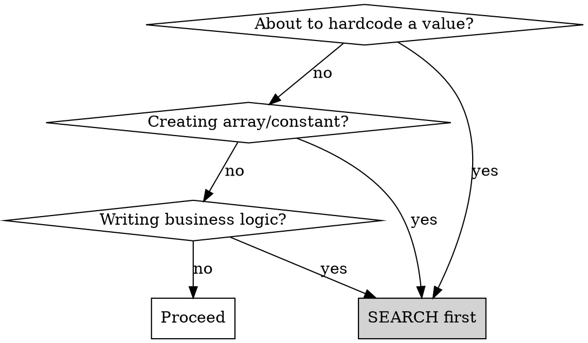

# DRY Violation Detection

## Overview

**Search BEFORE you implement. Every hardcoded value is a potential duplication.**

DRY (Don't Repeat Yourself) violations aren't just about copy-pasted code. They include:
- Hardcoded arrays that duplicate existing enums
- Type definitions that duplicate existing domain types
- Constants defined in multiple places
- Business logic that duplicates domain methods
- String literals that should reference enums

## When to Use



**Trigger symptoms:**
- "I'll just hardcode these values quickly"
- "I need a list of [X] types"
- "Let me define these constants"
- Creating a new enum/type
- Writing a calculation or detection method

## The Search-First Protocol

**Before implementing ANY of these, SEARCH the codebase:**

| You're implementing | Search for |
|---------------------|------------|
| Array of types | Existing enums: `export enum`, `*.enum.ts` |
| Constant values | Existing constants: `const.*=`, `*.constants.ts` |
| Type definition | Existing types: `interface`, `type.*=`, `domain/*.ts` |
| Detection/calculation logic | Domain methods with similar names |
| String literals | Enum values that match |

### Search Commands

```bash
# Find enums
grep -r "export enum" src/

# Find type/constant by concept name (example: payment types)
grep -ri "payment.*type\|PaymentType" src/

# Find domain methods
grep -r "isEligible\|calculate\|validate" src/

# Find all type definitions
grep -r "export type\|export interface" src/
```

## Common DRY Violation Patterns

### 1. Hardcoded Array vs Existing Enum

```typescript
// ❌ DRY VIOLATION: Hardcoded array
const ORDER_STATUSES = ['pending', 'confirmed', 'shipped', 'delivered'];

// ✅ CORRECT: Reference existing enum
import { OrderStatus } from './domain/order-status.enum';
const statuses = Object.values(OrderStatus);
```

### 2. Local Constant vs Shared Definition

```typescript
// ❌ DRY VIOLATION: Local constant duplicating domain knowledge
const PREMIUM_TIERS = [UserTier.Gold, UserTier.Platinum, UserTier.Diamond];

// ✅ CORRECT: Use existing domain method or shared constant
const isPremium = user.isPremiumTier();
// Or use shared constant:
import { PREMIUM_TIERS } from './domain/user-tier-groups';
```

### 3. New Type vs Existing Domain Type

```typescript
// ❌ DRY VIOLATION: Creating duplicate type
interface ProductCategory {
  name: string;
  products: string[];
}

// ✅ CORRECT: Import existing definition
import { ProductCategory } from './domain/product-category';
```

### 4. Service Logic vs Domain Method

```typescript
// ❌ DRY VIOLATION: Logic that belongs in domain
class DiscountCalculationService {
  isEligibleForDiscount(orders: Order[]): boolean {
    return orders.filter(o => o.status === 'completed').length >= 5;
  }
}

// ✅ CORRECT: Domain method already exists (or should)
const isEligible = customer.isEligibleForDiscount();
```

### 5. String Literals vs Enum Values

```typescript
// ❌ DRY VIOLATION: String literal
if (payment.method === 'credit_card') { ... }

// ✅ CORRECT: Use enum
if (payment.method === PaymentMethod.CreditCard) { ... }
```

### 6. Duplicate Validation Logic

```typescript
// ❌ DRY VIOLATION: Validation duplicated in controller and service
// In controller:
if (!email.includes('@')) throw new BadRequest('Invalid email');
// In service:
if (!email.includes('@')) throw new Error('Invalid email');

// ✅ CORRECT: Centralized validation
import { validateEmail } from './domain/validators';
validateEmail(email); // Throws if invalid
```

## Quick Reference: Where to Search

| Concept | Search locations |
|---------|------------------|
| Enums | `src/*/domain/*.enum.ts`, `src/enums/`, `src/types/` |
| Types/Interfaces | `src/*/domain/*.ts`, `src/common/`, `src/types/` |
| Constants | `src/*/domain/*.ts`, `src/shared/`, `src/constants/` |
| Domain methods | `src/*/domain/*.ts` (look for classes with business logic) |
| Validators | `src/common/validators/`, `src/*/domain/validators/` |
| DTOs | `src/*/dto/*.ts` |

## Red Flags - STOP and Search

| You're about to... | STOP and search for... |
|-------------------|------------------------|
| Define array of types | Existing enum |
| Create constant | Existing constant/enum |
| Write detection logic | Existing domain method |
| Define new interface | Existing type |
| Use string literal | Existing enum value |
| Create calculation service | Existing domain method |
| Add validation logic | Existing validators |
| Define error messages | Existing error constants |

## Audit Checklist

When reviewing code for DRY violations:

- [ ] Are there hardcoded arrays that duplicate enums?
- [ ] Are there local constants that duplicate shared definitions?
- [ ] Are there type definitions that duplicate domain types?
- [ ] Are there service methods that duplicate domain logic?
- [ ] Are there string literals that should reference enums?
- [ ] Are the same values defined in multiple places?
- [ ] Is validation logic duplicated across layers?
- [ ] Are error messages defined inline instead of using constants?

## Impact of DRY Violations

| Violation | Impact |
|-----------|--------|
| Duplicate constant | Changes must be made in multiple places |
| Duplicate enum values | Values drift out of sync |
| Duplicate logic | Bug fixes miss some copies |
| String literals vs enums | Typos cause runtime errors |
| Duplicate types | Incompatible interfaces |
| Duplicate validation | Inconsistent behavior across layers |

## Conceptual Groupings: Centralize or Inline?

Even when using proper enum references, creating groupings can be a DRY violation.

**Ask:** Is this grouping a domain concept or a one-off filter?

| Situation | Action |
|-----------|--------|
| Grouping appears in 2+ places | Centralize in domain |
| Grouping represents domain concept (e.g., "premium tiers") | Centralize in domain |
| Grouping is UI-specific filter, used once | OK to inline |

```typescript
// ❌ POTENTIAL DRY VIOLATION: Domain concept scattered
// In service A:
const refundableStatuses = [OrderStatus.Pending, OrderStatus.Confirmed];
// In service B:
const refundableStatuses = [OrderStatus.Pending, OrderStatus.Confirmed];

// ✅ CORRECT: Centralize domain concept
// In domain/order-status-groups.ts:
export const REFUNDABLE_STATUSES = [
  OrderStatus.Pending,
  OrderStatus.Confirmed
] as const;

// Usage everywhere:
import { REFUNDABLE_STATUSES } from './domain/order-status-groups';
```

**Search before creating any grouping:**
```bash
grep -ri "pending.*confirmed\|refundable" src/
```

## Domain Methods vs Service Methods

When you need logic that operates on domain data, ask:

| Question | If YES → | If NO → |
|----------|----------|---------|
| Does this logic operate on data inside a single entity? | Domain method | Service method |
| Would multiple services need this logic? | Domain method | Consider service |
| Is this a core business rule? | Domain method | Service method |
| Does it require external calls (DB, API)? | Service method | Domain method |

```typescript
// ❌ Service with logic that belongs in domain
class OrderService {
  canBeCancelled(order: Order): boolean {
    return ['pending', 'confirmed'].includes(order.status) &&
           order.createdAt > Date.now() - 24 * 60 * 60 * 1000;
  }
}

// ✅ Domain method
class Order {
  canBeCancelled(): boolean {
    return this.isInCancellableStatus() && this.isWithinCancellationWindow();
  }

  private isInCancellableStatus(): boolean {
    return CANCELLABLE_STATUSES.includes(this.status);
  }

  private isWithinCancellationWindow(): boolean {
    return this.createdAt > Date.now() - CANCELLATION_WINDOW_MS;
  }
}
```

## Common Rationalizations

| Excuse | Reality |
|--------|---------|
| "It's faster to hardcode" | 30 seconds of searching prevents hours of debugging |
| "This is just a quick helper" | Quick helpers become permanent code |
| "I don't know if it exists" | That's why you search first |
| "This is a different context" | Same concept = same definition |
| "It's just a small array" | Small duplications multiply |
| "I'll refactor later" | Later never comes |
| "It's just 2 values" | Small groupings still represent domain concepts |
| "The other code is in a different module" | Shared concepts should be in shared location |
| "I need slightly different behavior" | Parameterize the existing code |

## Prevention Strategies

### 1. Establish Canonical Locations

Document where different types of definitions live:

```
src/
├── shared/
│   ├── constants/      # App-wide constants
│   ├── enums/          # Shared enums
│   └── types/          # Shared type definitions
├── [module]/
│   └── domain/
│       ├── *.enum.ts   # Module-specific enums
│       ├── *.ts        # Domain entities with methods
│       └── groups/     # Conceptual groupings
```

### 2. Naming Conventions

Consistent naming makes searching easier:

| Pattern | Naming Convention |
|---------|-------------------|
| Enum | `PascalCase` ending with type: `OrderStatus`, `PaymentMethod` |
| Grouping constant | `SCREAMING_SNAKE_CASE`: `REFUNDABLE_STATUSES`, `PREMIUM_TIERS` |
| Domain method | Descriptive verb: `canBeCancelled()`, `isEligible()`, `calculateTotal()` |

### 3. Code Review Questions

- "Does this constant/type already exist?"
- "Could this logic be a domain method?"
- "Is this grouping used elsewhere?"
- "Did you search before implementing?"
