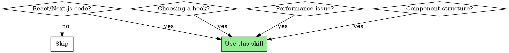
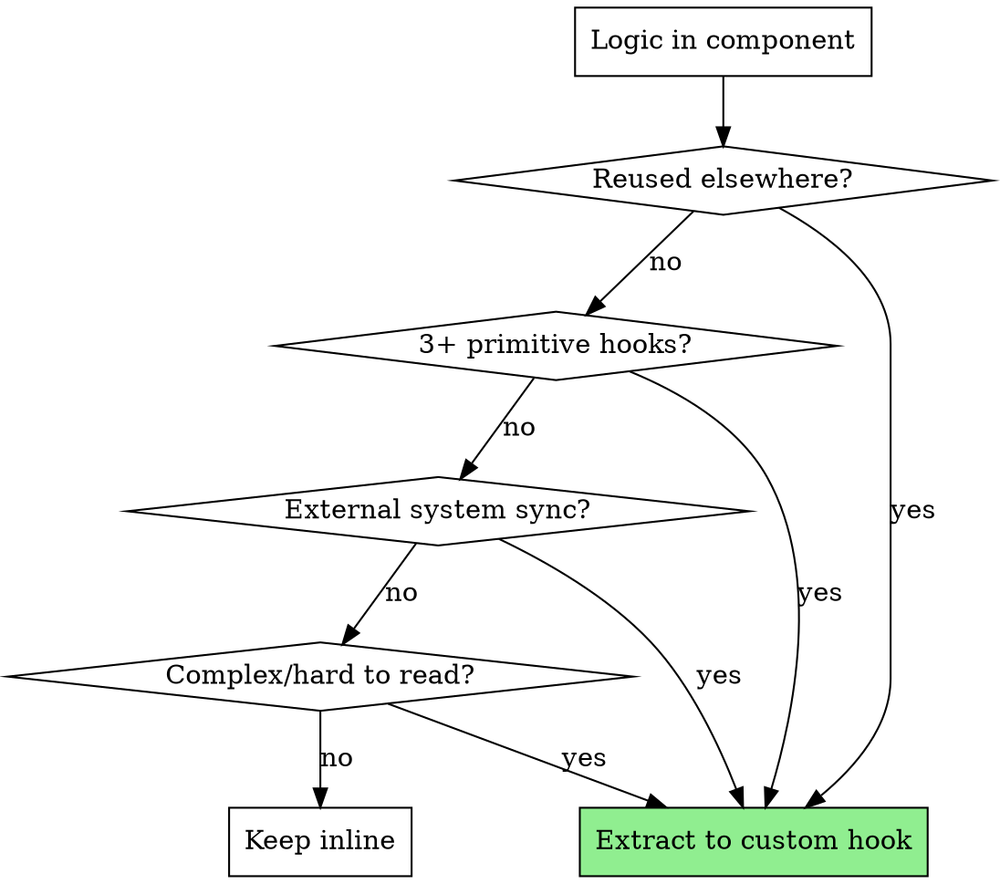
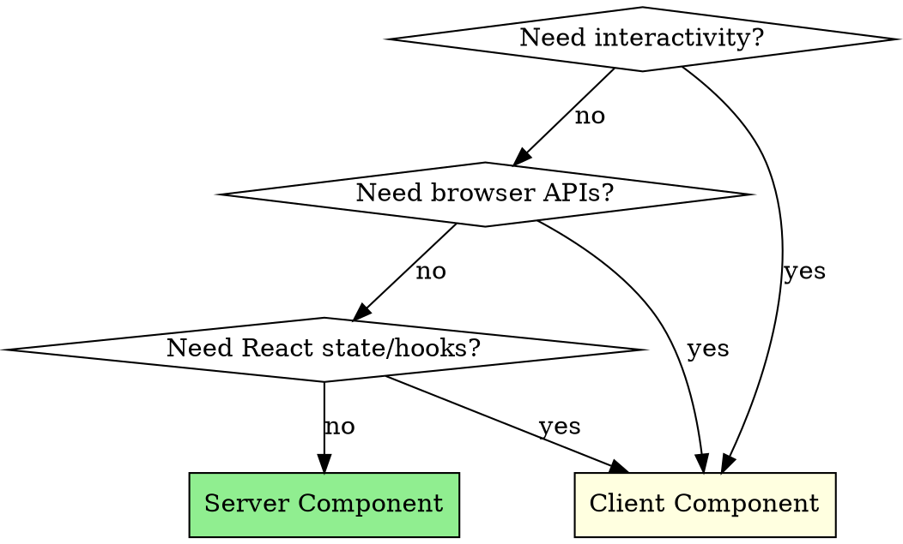

# React & Next.js Best Practices Validator

## Overview

Comprehensive validator for React 19+ and Next.js 15+ best practices. Use this skill to review code, suggest better hooks, optimize performance, and ensure modern patterns are followed.

**Core principle:** Prefer Server Components, extract logic to custom hooks, memoize intentionally (not everywhere), and let React Compiler handle optimizations when available.

**External reference:** For Vercel's detailed performance rules (45 rules in 8 categories), see the `vercel-react-best-practices` skill. That skill provides prioritized rules for: eliminating waterfalls (async-*), bundle optimization (bundle-*), server-side performance (server-*), client-side fetching (client-*), re-render optimization (rerender-*), rendering performance (rendering-*), JavaScript patterns (js-*), and advanced patterns (advanced-*).

## When to Use



**Use when:**
- Reviewing React component code
- Choosing between hooks (useState vs useReducer, useMemo vs useCallback)
- Optimizing re-renders or bundle size
- Deciding Server vs Client Components
- Extracting logic to custom hooks
- Implementing forms with React 19 Actions

**Skip when:** Non-React code, simple HTML/CSS only

---

## Quick Reference: Hook Selection

| Situation | Use This | Not This |
|-----------|----------|----------|
| Simple primitive state | `useState` | `useReducer` |
| 3+ related useState calls | `useReducer` | Multiple `useState` |
| Complex state transitions | `useReducer` | `useState` with objects |
| Expensive calculation | `useMemo` | Recalculate every render |
| Function passed to memoized child | `useCallback` | Inline function |
| Form submission state | `useFormStatus` | Manual `isLoading` state |
| Optimistic UI updates | `useOptimistic` | Manual optimistic state |
| Form action state | `useActionState` | `useState` + `useEffect` |
| Read promise in render | `use` | `useEffect` + `useState` |
| Side effect on mount/change | `useEffect` | Inline code |
| DOM measurement before paint | `useLayoutEffect` | `useEffect` |
| Share logic between components | Custom hook | Copy-paste code |

---

## React 19 New Hooks

### useActionState
Replaces manual loading/error/success state management for actions.

```typescript
// ❌ OLD: Manual state management
const [isLoading, setIsLoading] = useState(false);
const [error, setError] = useState(null);
const [data, setData] = useState(null);

const handleSubmit = async () => {
  setIsLoading(true);
  try {
    const result = await submitForm();
    setData(result);
  } catch (e) {
    setError(e);
  } finally {
    setIsLoading(false);
  }
};

// ✅ NEW: useActionState
const [state, submitAction, isPending] = useActionState(
  async (previousState, formData) => {
    const result = await submitForm(formData);
    return result;
  },
  initialState
);
```

### useFormStatus
Access form submission state from any child component without prop drilling.

```typescript
// ✅ Inside a form - no props needed
function SubmitButton() {
  const { pending, data, method, action } = useFormStatus();
  return (
    <button disabled={pending}>
      {pending ? 'Submitting...' : 'Submit'}
    </button>
  );
}
```

**Rule:** Must be used inside a `<form>` - won't work outside form context.

### useOptimistic
Instant UI feedback before server response.

```typescript
// ✅ Optimistic updates
function TodoList({ todos, addTodo }) {
  const [optimisticTodos, addOptimisticTodo] = useOptimistic(
    todos,
    (state, newTodo) => [...state, { ...newTodo, pending: true }]
  );

  const handleAdd = async (formData) => {
    const newTodo = { text: formData.get('text'), id: Date.now() };
    addOptimisticTodo(newTodo); // Instant UI update
    await addTodo(newTodo);     // Server request
  };

  return (
    <ul>
      {optimisticTodos.map(todo => (
        <li key={todo.id} style={{ opacity: todo.pending ? 0.5 : 1 }}>
          {todo.text}
        </li>
      ))}
    </ul>
  );
}
```

### use API
Read promises and context conditionally in render.

```typescript
// ✅ Read promise in render (with Suspense)
function UserProfile({ userPromise }) {
  const user = use(userPromise); // Suspends until resolved
  return <div>{user.name}</div>;
}

// ✅ Conditional context (not possible with useContext)
function Theme({ isAdmin }) {
  if (isAdmin) {
    const theme = use(AdminThemeContext);
    return <AdminPanel theme={theme} />;
  }
  return <UserPanel />;
}
```

---

## Hooks: Do's and Don'ts

### useState

| ✅ DO | ❌ DON'T |
|-------|----------|
| Use for simple, independent values | Store derived state (calculate instead) |
| Use functional updates when depending on prev state | Mutate state directly |
| Initialize with function for expensive computations | Create objects/arrays inline in useState |
| Keep state close to where it's used | Lift state higher than necessary |

```typescript
// ❌ Derived state anti-pattern
const [items, setItems] = useState([]);
const [filteredItems, setFilteredItems] = useState([]); // Derived!

useEffect(() => {
  setFilteredItems(items.filter(i => i.active));
}, [items]);

// ✅ Calculate derived values
const [items, setItems] = useState([]);
const filteredItems = items.filter(i => i.active); // Calculated each render
// Or memoize if expensive:
const filteredItems = useMemo(() => items.filter(i => i.active), [items]);
```

### useReducer

| ✅ DO | ❌ DON'T |
|-------|----------|
| Use when 3+ related useState calls | Use for simple boolean toggles |
| Use when next state depends on previous | Mutate state in reducer |
| Group related state transitions | Create massive switch statements |
| Return new state object always | Forget to handle unknown actions |

```typescript
// ✅ Good useReducer pattern
type State = { status: 'idle' | 'loading' | 'success' | 'error'; data: Data | null; error: Error | null };
type Action =
  | { type: 'FETCH_START' }
  | { type: 'FETCH_SUCCESS'; payload: Data }
  | { type: 'FETCH_ERROR'; error: Error };

function reducer(state: State, action: Action): State {
  switch (action.type) {
    case 'FETCH_START':
      return { ...state, status: 'loading', error: null };
    case 'FETCH_SUCCESS':
      return { status: 'success', data: action.payload, error: null };
    case 'FETCH_ERROR':
      return { status: 'error', data: null, error: action.error };
    default:
      return state;
  }
}
```

### useMemo & useCallback

| ✅ DO | ❌ DON'T |
|-------|----------|
| Use when calculation is noticeably slow | Wrap everything "just in case" |
| Use when value is passed to memoized child | Use for simple calculations |
| Use when value is a useEffect dependency | Forget: initial render is slower with memo |
| Remove when React Compiler is active | Create new objects/arrays in dependencies |

```typescript
// ❌ Unnecessary memoization
const doubled = useMemo(() => count * 2, [count]); // Simple math

// ✅ Necessary memoization
const sortedItems = useMemo(() =>
  [...items].sort((a, b) => a.name.localeCompare(b.name)),
  [items]
); // Expensive for large arrays

// ✅ useCallback for memoized child
const handleClick = useCallback(() => {
  onItemSelect(item.id);
}, [item.id, onItemSelect]);

<MemoizedButton onClick={handleClick} /> // Won't re-render unnecessarily
```

**React Compiler (2025):** With React Compiler enabled, remove manual useMemo/useCallback - the compiler handles optimization automatically.

### useEffect

| ✅ DO | ❌ DON'T |
|-------|----------|
| Synchronize with external systems | Fetch data (use Server Components/TanStack Query) |
| Set up subscriptions/event listeners | Transform data for rendering |
| Always return cleanup function | Use async directly on useEffect |
| Keep dependency array accurate | Omit dependencies to "fix" infinite loops |
| Use one effect per concern | Put unrelated logic in same effect |

```typescript
// ❌ Common mistakes
useEffect(async () => { // Can't be async directly
  const data = await fetchData();
}, []);

useEffect(() => {
  fetchData(); // No cleanup for async
}, []);

// ✅ Correct patterns
useEffect(() => {
  let cancelled = false;

  async function fetchData() {
    const result = await api.getData();
    if (!cancelled) setData(result);
  }

  fetchData();
  return () => { cancelled = true; }; // Cleanup
}, []);

// ✅ Better: Use TanStack Query or Server Components instead
```

**Dependency Array Rules:**
- Empty `[]` = run once on mount
- No array = run every render (usually wrong)
- `[dep1, dep2]` = run when deps change
- State setters are stable - don't need to be in deps

---

## Custom Hooks: When to Extract

### Extract When



### Signs to Extract

| Signal | Action |
|--------|--------|
| Same useState+useEffect combo in 2+ components | Extract to `useXxx` hook |
| 3+ useState calls managing related state | Extract or use useReducer |
| useEffect syncing with external API/system | Extract to hide implementation |
| Can't name the hook clearly | Not ready to extract yet |
| Logic is component-specific, used once | Keep inline |

```typescript
// ❌ Repeated pattern across components
function ComponentA() {
  const [data, setData] = useState(null);
  const [loading, setLoading] = useState(false);
  const [error, setError] = useState(null);

  useEffect(() => {
    setLoading(true);
    fetchData().then(setData).catch(setError).finally(() => setLoading(false));
  }, []);
  // ...
}

// ✅ Extracted custom hook
function useData(fetchFn) {
  const [data, setData] = useState(null);
  const [loading, setLoading] = useState(true);
  const [error, setError] = useState(null);

  useEffect(() => {
    let cancelled = false;
    fetchFn()
      .then(result => !cancelled && setData(result))
      .catch(err => !cancelled && setError(err))
      .finally(() => !cancelled && setLoading(false));
    return () => { cancelled = true; };
  }, [fetchFn]);

  return { data, loading, error };
}

// ✅ Even better: Use TanStack Query
const { data, isLoading, error } = useQuery({ queryKey: ['data'], queryFn: fetchData });
```

### Custom Hook Rules

| ✅ DO | ❌ DON'T |
|-------|----------|
| Name with `use` prefix | Return JSX from hooks |
| Return values/functions only | Call hooks conditionally inside |
| Make hooks composable | Couple to specific components |
| Document the contract | Hide too much (make debugging hard) |

---

## Performance Optimization

### Re-render Prevention

| Technique | When to Use | Impact |
|-----------|-------------|--------|
| `React.memo` | Child re-renders with same props | Skip re-render |
| `useMemo` | Expensive calculation | Cache result |
| `useCallback` | Function passed to memo'd child | Stable reference |
| State colocation | State used by few components | Fewer re-renders |
| Context splitting | Context updates cause wide re-renders | Targeted updates |

```typescript
// ❌ Re-renders all children on any context change
const AppContext = createContext({ user: null, theme: 'light', notifications: [] });

// ✅ Split contexts by update frequency
const UserContext = createContext(null);      // Rarely changes
const ThemeContext = createContext('light');  // Rarely changes
const NotificationContext = createContext([]); // Frequently changes
```

### List Virtualization

For lists with 100+ items, use virtualization:

```typescript
import { useVirtualizer } from '@tanstack/react-virtual';

function VirtualList({ items }) {
  const parentRef = useRef(null);

  const virtualizer = useVirtualizer({
    count: items.length,
    getScrollElement: () => parentRef.current,
    estimateSize: () => 50,
  });

  return (
    <div ref={parentRef} style={{ height: 400, overflow: 'auto' }}>
      <div style={{ height: virtualizer.getTotalSize() }}>
        {virtualizer.getVirtualItems().map(virtualItem => (
          <div
            key={virtualItem.key}
            style={{
              position: 'absolute',
              top: virtualItem.start,
              height: virtualItem.size,
            }}
          >
            {items[virtualItem.index].name}
          </div>
        ))}
      </div>
    </div>
  );
}
```

### Code Splitting

```typescript
// ✅ Route-based splitting
const Dashboard = lazy(() => import('./Dashboard'));
const Settings = lazy(() => import('./Settings'));

function App() {
  return (
    <Suspense fallback={<Loading />}>
      <Routes>
        <Route path="/dashboard" element={<Dashboard />} />
        <Route path="/settings" element={<Settings />} />
      </Routes>
    </Suspense>
  );
}

// ✅ Component-based splitting for heavy components
const HeavyChart = lazy(() => import('./HeavyChart'));

function Analytics() {
  return (
    <div>
      <h1>Analytics</h1>
      <Suspense fallback={<ChartSkeleton />}>
        <HeavyChart />
      </Suspense>
    </div>
  );
}
```

---

## Next.js 15+ Best Practices

### Server vs Client Components



| Server Components ✅ | Client Components ✅ |
|---------------------|---------------------|
| Data fetching | onClick, onChange, onSubmit |
| Backend resources access | useState, useReducer, useEffect |
| Sensitive data (API keys) | Browser APIs (localStorage, etc.) |
| Large dependencies | Custom hooks with state |
| Static content | Real-time updates |

```typescript
// ✅ Server Component (default) - fetches data
async function UserProfile({ userId }) {
  const user = await db.user.findUnique({ where: { id: userId } });
  return (
    <div>
      <h1>{user.name}</h1>
      <UserActions user={user} /> {/* Client island */}
    </div>
  );
}

// ✅ Client Component - handles interactivity
'use client';
function UserActions({ user }) {
  const [isFollowing, setIsFollowing] = useState(user.isFollowing);
  return (
    <button onClick={() => setIsFollowing(!isFollowing)}>
      {isFollowing ? 'Unfollow' : 'Follow'}
    </button>
  );
}
```

**Pattern:** Keep most UI as Server Components, isolate interactivity in small Client Component "islands".

### Data Fetching Patterns

| Pattern | Use Case |
|---------|----------|
| Server Component fetch | Initial data, SEO content |
| Server Actions | Mutations, form submissions |
| TanStack Query | Client-side caching, real-time |
| `use` + Suspense | Streaming dynamic data |

```typescript
// ✅ Server Component data fetching
async function ProductPage({ id }) {
  const product = await fetch(`/api/products/${id}`).then(r => r.json());
  return <ProductDetails product={product} />;
}

// ✅ Server Action for mutations
'use server';
async function updateProduct(formData: FormData) {
  const id = formData.get('id');
  const name = formData.get('name');
  await db.product.update({ where: { id }, data: { name } });
  revalidatePath(`/products/${id}`);
}

// ✅ Client with TanStack Query for real-time
'use client';
function LiveComments({ postId }) {
  const { data: comments } = useQuery({
    queryKey: ['comments', postId],
    queryFn: () => fetchComments(postId),
    refetchInterval: 5000,
  });
  return <CommentList comments={comments} />;
}
```

### Caching in Next.js 15

**Breaking change:** Next.js 15 changed caching defaults - fetch requests are NOT cached by default.

| Cache Type | Default (v15) | Control |
|------------|---------------|---------|
| fetch() | No cache | `cache: 'force-cache'` |
| Route segments | Dynamic | `export const dynamic = 'force-static'` |
| Router Cache | 0 staleTime | Automatic for navigation |

```typescript
// ✅ Opt-in to caching
const data = await fetch(url, { cache: 'force-cache' }); // Cached
const data = await fetch(url, { next: { revalidate: 3600 } }); // ISR

// ✅ Route segment config
export const dynamic = 'force-static'; // SSG
export const revalidate = 60; // ISR every 60s

// ✅ Revalidate after mutation
'use server';
async function createPost(formData: FormData) {
  await db.post.create({ data: { title: formData.get('title') } });
  revalidatePath('/posts');
  revalidateTag('posts');
}
```

### Next.js Performance Checklist

| Area | Best Practice |
|------|---------------|
| **Images** | Use `next/image` with explicit width/height, `placeholder="blur"` |
| **Fonts** | Use `next/font`, limit weights, enable `display: swap` |
| **Scripts** | Use `next/script` with `lazyOnload` for third-party |
| **Bundle** | Analyze with `@next/bundle-analyzer`, use `optimizePackageImports` |
| **Rendering** | Default to Server Components, minimize Client Component scope |
| **Streaming** | Use Suspense boundaries for dynamic content |
| **PPR** | Enable Partial Prerendering for mixed static/dynamic routes |

```typescript
// ✅ Optimized Image
import Image from 'next/image';

<Image
  src="/hero.jpg"
  alt="Hero"
  width={1200}
  height={600}
  placeholder="blur"
  blurDataURL={blurUrl}
  priority // For above-fold images
/>

// ✅ Optimized Font
import { Inter } from 'next/font/google';

const inter = Inter({
  subsets: ['latin'],
  display: 'swap',
  variable: '--font-inter',
});

// ✅ Third-party Script
import Script from 'next/script';

<Script
  src="https://analytics.example.com/script.js"
  strategy="lazyOnload"
/>
```

### Partial Prerendering (PPR)

Combines static shell with streamed dynamic content:

```typescript
// next.config.js
module.exports = {
  experimental: {
    ppr: true,
  },
};

// Page with PPR
export default async function ProductPage({ params }) {
  const product = await getProduct(params.id); // Static at build

  return (
    <div>
      <h1>{product.name}</h1>
      <p>{product.description}</p>

      {/* Dynamic content streamed */}
      <Suspense fallback={<PriceSkeleton />}>
        <DynamicPrice productId={params.id} />
      </Suspense>

      <Suspense fallback={<ReviewsSkeleton />}>
        <DynamicReviews productId={params.id} />
      </Suspense>
    </div>
  );
}
```

---

## Anti-Patterns to Avoid

### Component Anti-Patterns

| ❌ Anti-Pattern | ✅ Solution |
|-----------------|-------------|
| Prop drilling through 3+ levels | Context, Zustand, or composition |
| Massive components (500+ lines) | Extract custom hooks, split components |
| Inline object/function props | Memoize with useMemo/useCallback |
| Storing derived state | Calculate or memoize instead |
| useEffect for data transformation | Transform during render |
| Index as key for dynamic lists | Use stable unique IDs |

### State Anti-Patterns

| ❌ Anti-Pattern | ✅ Solution |
|-----------------|-------------|
| Everything in global state | Keep local state local |
| Mutating state directly | Always create new references |
| Syncing state with useEffect | Single source of truth |
| Multiple useState for related data | useReducer |
| Context for frequently changing data | Zustand, Jotai, or split contexts |

### useEffect Anti-Patterns

| ❌ Anti-Pattern | ✅ Solution |
|-----------------|-------------|
| Missing cleanup function | Always return cleanup |
| Missing/wrong dependencies | Use exhaustive-deps lint rule |
| Async useEffect | Create inner async function |
| Data fetching in useEffect | Server Components, TanStack Query |
| Transforming props to state | useMemo or calculate inline |

---

## Code Review Checklist

When reviewing React/Next.js code, check:

### Hooks
- [ ] No hooks called conditionally or in loops
- [ ] useEffect has accurate dependency array
- [ ] useEffect has cleanup when needed
- [ ] useMemo/useCallback used only when necessary
- [ ] React 19 hooks used where applicable (useActionState, useOptimistic)
- [ ] Custom hooks extracted for reused logic

### Performance
- [ ] React.memo used for expensive pure components
- [ ] No inline objects/functions passed to memoized children
- [ ] Large lists virtualized
- [ ] Code split at route boundaries
- [ ] No derived state stored in useState

### Next.js
- [ ] Server Components by default
- [ ] 'use client' only where needed
- [ ] Images use next/image with dimensions
- [ ] Fonts use next/font
- [ ] Proper caching strategy configured
- [ ] Server Actions for mutations

### State
- [ ] State colocated as close as possible to usage
- [ ] No prop drilling beyond 2 levels
- [ ] Server state managed with TanStack Query or similar
- [ ] No state mutation, always new references

---

## Sources

### React 19
- [React v19 Official Blog](https://react.dev/blog/2024/12/05/react-19)
- [useOptimistic Documentation](https://react.dev/reference/react/useOptimistic)
- [New Hooks Guide - Telerik](https://www.telerik.com/blogs/guide-new-hooks-react-19)
- [React 19 New Hooks - FreeCodeCamp](https://www.freecodecamp.org/news/react-19-new-hooks-explained-with-examples/)

### Hooks Best Practices
- [useMemo and useCallback - Josh Comeau](https://www.joshwcomeau.com/react/usememo-and-usecallback/)
- [How to use memo/callback - Developerway](https://www.developerway.com/posts/how-to-use-memo-use-callback)
- [useCallback Documentation](https://react.dev/reference/react/useCallback)
- [useMemo Documentation](https://react.dev/reference/react/useMemo)

### Performance
- [React Performance 2025 - Growin](https://www.growin.com/blog/react-performance-optimization-2025/)
- [Performance Guide - DEV Community](https://dev.to/amaresh_adak/react-performance-optimization-from-slow-to-lightning-fast-complete-guide-2025-19hl)
- [memo Documentation](https://react.dev/reference/react/memo)

### Custom Hooks
- [Reusing Logic with Custom Hooks](https://react.dev/learn/reusing-logic-with-custom-hooks)
- [Hooks Pattern - patterns.dev](https://www.patterns.dev/react/hooks-pattern/)

### Next.js
- [Server and Client Components](https://nextjs.org/docs/app/getting-started/server-and-client-components)
- [Server Actions](https://nextjs.org/docs/app/building-your-application/data-fetching/server-actions-and-mutations)
- [Caching Guide](https://nextjs.org/docs/app/guides/caching)
- [Partial Prerendering](https://nextjs.org/docs/15/app/getting-started/partial-prerendering)
- [Core Web Vitals Optimization - Makers Den](https://makersden.io/blog/optimize-web-vitals-in-nextjs-2025)
- [Next.js Performance 2025 - Pagepro](https://pagepro.co/blog/nextjs-performance-optimization-in-9-steps/)

### Anti-Patterns
- [React Anti-Patterns - OOZOU](https://oozou.com/blog/6-react-anti-patterns-to-avoid-206)
- [Prop Drilling Solutions 2025](https://medium.com/@tejasvinavale1599/how-to-eliminate-prop-drilling-completely-the-2025-state-architecture-guide-for-react-developers-54460d9f3683)
- [useEffect Common Mistakes](https://chudovo.com/react-useeffect-common-mistakes-and-how-to-avoid-them/)
