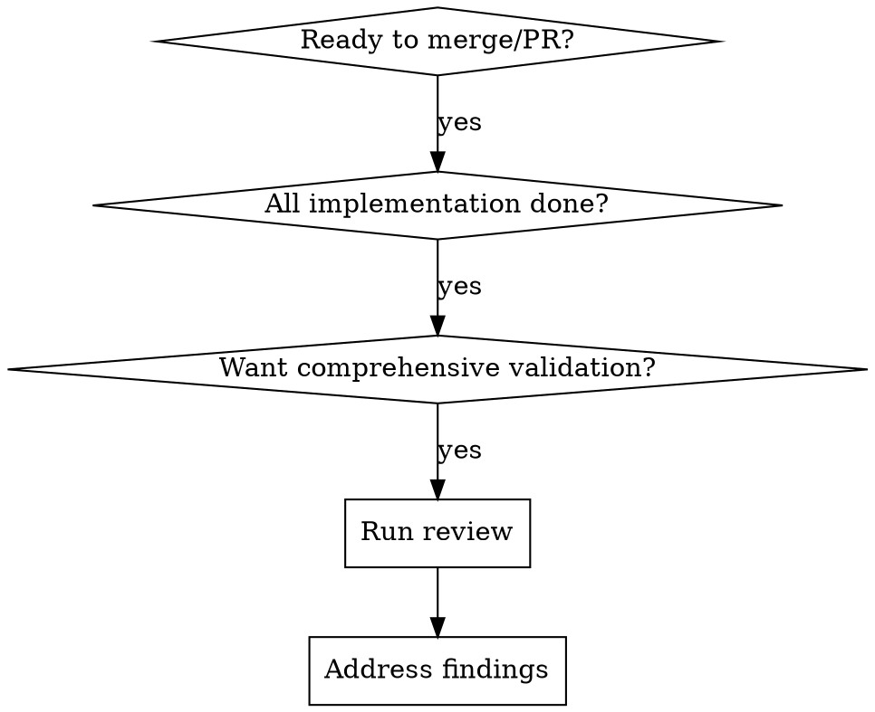

# Comprehensive Branch Code Review

## Overview

This skill orchestrates a multi-agent code review of your current branch, validating changes against:
- **DDD/OOP Compliance**: Rich domain models, proper encapsulation, method placement
- **DRY Violations**: Code duplication, repeated patterns, principle violations
- **Clean Code Principles**: Naming, function size, SOLID, code smells, readability
- **Architecture Adherence**: Layer separation, dependency direction, pattern usage
- **Test Coverage**: Test existence, quality, and coverage for changed code

## When to Use



**Use this when:**
- Feature implementation is complete
- Before creating a pull request
- Before merging to main branch
- After significant refactoring
- When you want confidence in code quality across multiple dimensions

**Don't use for:**
- Exploratory/draft code still in progress
- Quick hotfixes (use quick-check instead)
- Code you haven't fully written yet

---

## The Process

### Phase 1: Branch Analysis

First, analyze what changed on your branch:

```bash
# Show git status
git status

# Show full diff to understand scope
git diff main...HEAD

# Show recent commits to see commit messages
git log main...HEAD --oneline
```

**What we're looking for:**
- How many files changed?
- What modules/domains affected?
- Is this a feature, refactor, bugfix, or test change?
- Any suspicious patterns (very large diffs, deletions, renames)?

### Phase 2: Parallel Review Agents

Dispatch independent agents in parallel to review different aspects. Each agent specializes in one dimension:

#### 🏗️ **Architecture Compliance Agent**
Reviews:
- ✅ Layer separation (domain/application/infrastructure)
- ✅ Dependency direction (inward toward domain)
- ✅ ORM/framework decorators only in infrastructure layer
- ✅ Mapper usage between domain and persistence entities
- ✅ Repository pattern implementation
- ✅ Module structure and boundaries

**What it checks:**
- No persistence decorators in domain files
- Infrastructure entities in correct location
- Domain objects are pure (no framework dependencies)
- Proper use of ports/adapters pattern

---

#### 🎯 **DDD/OOP Validation Agent**
Reviews:
- ✅ Rich vs Anemic domain models
- ✅ Proper encapsulation
- ✅ Tell, Don't Ask principle
- ✅ Method placement (domain vs service)
- ✅ Parameter reduction (passing objects vs primitives)
- ✅ Invariant protection (non-nullable fields)
- ✅ Aggregate design

**What it checks:**
- Are domain objects just data containers? (RED FLAG)
- Are calculations happening in services instead of entities? (RED FLAG)
- Are services extracting data and doing work instead of telling objects? (RED FLAG)
- Are there defensive null checks for invariant data? (RED FLAG)

**References the `ddd-oop` skill for patterns.**

---

#### 🚫 **DRY Violations Agent**
Reviews:
- ✅ Code duplication
- ✅ Repeated patterns
- ✅ Magic strings/numbers that could be constants/enums
- ✅ Similar logic in different services
- ✅ Reusable code that's been reimplemented

**What it checks:**
- Is the same logic copy-pasted in multiple places?
- Are there hardcoded values that should be enums/constants?
- Could a helper/utility reduce duplication?

**References the `dry-violations` skill for patterns.**

---

#### ✅ **Test Coverage Agent**
Reviews:
- ✅ Test files exist for new code
- ✅ Test quality (units, E2E, integration)
- ✅ Coverage of business logic
- ✅ Edge cases covered
- ✅ Mocking appropriateness

**What it checks:**
- Every service/controller method has tests?
- Domain logic has unit tests (pure, no mocks)?
- Integration tests for repository interactions?

---

#### 🧹 **Clean Code Validator Agent**
Reviews:
- ✅ Naming conventions (intention-revealing names)
- ✅ Function length and complexity (SRP, <20 lines ideal)
- ✅ Code smells (long parameter lists, feature envy, god classes)
- ✅ Proper abstraction levels
- ✅ Comments (explain WHY, not WHAT)
- ✅ Error handling patterns
- ✅ SOLID principles adherence

**What it checks:**
- Are function/method names self-explanatory?
- Are functions small and focused on one thing?
- Are there code smells that need refactoring?
- Is the code readable without extensive comments?
- Does error handling follow best practices?

---

### Phase 3: Findings Report

Each agent returns findings categorized by:

| Severity | Meaning | Action |
|----------|---------|--------|
| 🔴 **CRITICAL** | Must fix before merge | Blocks PR approval |
| 🟠 **HIGH** | Should fix before merge | Prefer to fix before merge |
| 🟡 **MEDIUM** | Should address | Can address in follow-up |
| 🟢 **LOW** | Nice to have | Can defer |

---

### Phase 4: Quality Gates

Your code passes review when:

```
✅ CRITICAL: Zero critical issues
✅ HIGH: Zero high issues (or documented exceptions)
✅ MEDIUM: Reasonable number (tracked in follow-up)
✅ DDD/OOP: No anemic models, proper encapsulation
✅ DRY: Duplication identified and justified
✅ CLEAN CODE: Good naming, small functions, SOLID principles
✅ TESTS: New code has tests, coverage > threshold
```

---

## Step-by-Step Execution

### Step 1: Analyze Current Branch

```bash
# See what we're reviewing
git branch --show-current
git status
git log -5 --oneline
```

**Questions to answer:**
- How many files changed? (1-10 is small, 10-50 is medium, 50+ needs investigation)
- How many lines added/deleted?
- What was the intent? (Read commits)

---

### Step 2: Run Architecture Review

**Task:** Verify architecture compliance

**Check each modified file:**
1. Is it in the right directory? (domain vs infrastructure vs application)
2. Does it follow the project's module structure?
3. Are there framework/ORM decorators in domain code?
4. Are mappers used properly between layers?

**Sample commands:**
```bash
# Find modified domain files
git diff main...HEAD --name-only | grep -E 'domain/|entities/'

# Find modified infrastructure files
git diff main...HEAD --name-only | grep -E 'infrastructure/|persistence/'

# Check for ORM decorators in domain (example for TypeORM)
git diff main...HEAD -- src/ | grep -E '@(Column|Entity|Index)' | grep domain/

# Check for Prisma in domain
git diff main...HEAD -- src/ | grep -E 'prisma\.' | grep domain/
```

**Findings:**
- List each file reviewed
- Note any architectural violations
- Suggest fixes with specific file:line references

---

### Step 3: Run DDD/OOP Review

**Task:** Validate domain models are rich, not anemic

**Checklist:**

- [ ] Domain entities have behavior methods (not just getters)
- [ ] Services don't extract data and calculate (they tell, don't ask)
- [ ] No defensive null checks for invariant data
- [ ] Methods are on the objects that own the data
- [ ] Domain objects reduce service parameter count
- [ ] Aggregates protect business invariants

**Red flags to search for:**
```bash
# Look for data extraction patterns
git diff main...HEAD | grep -E '\.filter\(|\.map\(|\.some\(' | head -20

# Look for null checks (might be defensive)
git diff main...HEAD | grep -E 'if \(.*\?|\?\.|!=' | head -20

# Look for services with many parameters
git diff main...HEAD | grep -E 'function.*\(.*,.*,.*,.*,' | head -20
```

**Findings:**
- For each file: is the domain model rich or anemic?
- Call out any Tell/Don't Ask violations
- Suggest moving logic from service to entity if applicable

---

### Step 4: Run DRY Violations Review

**Task:** Identify code duplication and repeated patterns

**Check for:**
1. **Identical logic** - copy-pasted code blocks
2. **Similar patterns** - same logic with minor variations
3. **Magic values** - hardcoded strings/numbers that should be constants
4. **Utility duplication** - similar helper methods in different services

**Search techniques:**
```bash
# Look for repeated string literals
git diff main...HEAD | grep -E '"[^"]{20,}"' | sort | uniq -c | sort -rn | head -20

# Look for similar if/else patterns
git diff main...HEAD | grep -E 'if.*===|if.*includes\(' | head -20

# Check for similar array definitions
git diff main...HEAD | grep -E '\[.*,.*,.*\]' | head -20
```

**Findings:**
- List each duplication found
- Show before/after (use same constant/helper)
- Suggest extraction strategies

---

### Step 5: Assess Test Coverage

**Task:** Verify new/changed code has appropriate tests

**Check:**
1. **Unit tests** exist for modified code
2. **Integration/E2E tests** exist for API changes
3. **Test quality** - tests verify behavior, not implementation
4. **Coverage** - edge cases covered

**Search:**
```bash
# Find modified source files
git diff main...HEAD --name-only | grep -E '\.(ts|js|py|go|java)$' | grep -v test | grep -v spec

# Find modified test files
git diff main...HEAD --name-only | grep -E '(test|spec)\.'

# Compare: does each source file have a test?
```

**Findings:**
- Test coverage summary (% of changed code with tests)
- Missing test files
- Test quality observations

---

### Step 6: Run Clean Code Validation

**Task:** Validate code against clean code principles

**Checklist:**

- [ ] Function/method names are intention-revealing
- [ ] Functions are small (<20 lines ideal) and do one thing
- [ ] Classes have single responsibility
- [ ] No long parameter lists (consider parameter objects)
- [ ] No code smells (feature envy, god classes, primitive obsession)
- [ ] Comments explain WHY, not WHAT (code is self-documenting)
- [ ] Error handling follows best practices
- [ ] SOLID principles are followed

**Search:**
```bash
# Look for long functions (rough indicator)
git diff main...HEAD -- '*.ts' '*.js' | grep -E '^\+\s*(async\s+)?function|^\+\s*(async\s+)?[a-zA-Z]+\s*\(' | head -20

# Look for long parameter lists
git diff main...HEAD | grep -E '\([^)]{100,}\)' | head -20

# Look for deeply nested code (many indentation levels)
git diff main...HEAD | grep -E '^\+\s{16,}' | head -20
```

**Findings:**
- Overall code quality score (1-10)
- Code smells identified with severity
- Specific refactoring recommendations

---

### Step 7: Generate Summary Report

**Format:**

```markdown
# Code Review Summary

## Branch: [branch-name]
## Commits: [X commits, Y files changed, Z lines added/removed]

---

## 🏗️ Architecture Compliance
Status: ✅ PASS / 🟡 NEEDS WORK / 🔴 FAIL

Issues:
- [Issue 1: description, file:line, severity]

Recommendations:
- [Fix 1]

---

## 🎯 DDD/OOP Compliance
Status: ✅ PASS / 🟡 NEEDS WORK / 🔴 FAIL

Red Flags:
- [Flag 1: description, file:line]

Observations:
- [Positive observation 1]

---

## 🚫 DRY Violations
Status: ✅ PASS / 🟡 NEEDS WORK / 🔴 FAIL

Duplications Found:
- [Duplication 1: in File A:line, File B:line, suggested fix]

---

## 🧹 Clean Code Quality
Status: ✅ PASS / 🟡 NEEDS WORK / 🔴 FAIL

Issues Found:
- [Issue 1: severity, principle violated, file:line]

Strengths:
- [What the code does well]

---

## ✅ Test Coverage
Status: ✅ PASS / 🟡 NEEDS WORK / 🔴 FAIL

Coverage:
- [N% of new code has tests]
- [X test files added/modified]

Missing Tests:
- [Service A - missing tests]

---

## 🚦 Quality Gates

| Gate | Status | Notes |
|------|--------|-------|
| Critical Issues | ✅ 0 | Ready to merge |
| High Issues | ✅ 0 | No blockers |
| Architecture | ✅ PASS | Follows patterns |
| DDD/OOP | 🟡 REVIEW | [Issues: ...] |
| DRY | ✅ PASS | [Info: ...] |
| Clean Code | ✅ PASS | [Info: ...] |
| Tests | ✅ PASS | [Coverage: ...] |

---

## 📋 Checklist Before Merge

- [ ] All critical issues resolved
- [ ] All high issues resolved or documented
- [ ] No anemic domain models
- [ ] No suspicious code duplication
- [ ] New code has tests
- [ ] Architecture adheres to project patterns
- [ ] Tests pass locally and in CI
- [ ] Commit messages follow conventions
- [ ] No console.logs or debug code

---

## ✨ Next Steps

1. Address critical findings
2. Review recommendations
3. Update code as needed
4. Run tests
5. Create PR with this review as reference
```

---

## Parallel Execution

All review dimensions are **independent** and should run in parallel:

1. Launch **Architecture Compliance Agent** → checks files/patterns
2. Launch **DDD/OOP Validator Agent** → checks domain model richness
3. Launch **DRY Violations Agent** → checks duplications
4. Launch **Test Coverage Agent** → checks test files/coverage
5. Launch **Clean Code Validator Agent** → checks code quality, naming, SOLID

While agents run, collect git information:
- Branch metadata
- Diff statistics
- Recent commits

All results converge into single summary report.

---

## Common Patterns to Look For

### ❌ Anemic Model Red Flags

```typescript
// RED FLAG: Service doing calculations that entity should do
export class DiscountService {
  calculateDiscount(orders: Order[]): number {
    const completed = orders.filter(o => o.status === 'completed');
    return completed.length >= 5 ? 0.1 : 0;
  }
}

// GOOD: Entity method
export class Customer {
  getDiscountRate(): number {
    return this.orders.filter(o => o.isCompleted()).length >= 5 ? 0.1 : 0;
  }
}
```

### ❌ Tell/Don't Ask Red Flags

```typescript
// RED FLAG: Extracting data and deciding in service
const isPremium = user.subscriptions
  .filter(s => !s.cancelledAt)
  .some(s => PREMIUM_TIERS.includes(s.tier));

// GOOD: Tell the entity what you need
const isPremium = user.isPremiumMember();
```

### ❌ Parameter Bloat Red Flags

```typescript
// RED FLAG: Too many primitives passed
service.processOrder(
  orderId, customerId, customerType, items, totalAmount,
  discountRate, shippingAddress, billingAddress, paymentMethod
);

// GOOD: Pass rich domain objects
service.processOrder({
  order,      // Contains id, items, total
  customer,   // Contains id, type, addresses
  payment     // Contains method, billing
});
```

### ❌ DRY Violations

```typescript
// RED FLAG: Magic string repeated
if (status === 'active') { ... }
if (status === 'active') { ... }  // Duplicated

// GOOD: Use enum or constant
if (status === OrderStatus.Active) { ... }
```

---

## Review Checklist

- [ ] **Branch analyzed** - understand what changed
- [ ] **Architecture reviewed** - files in right places
- [ ] **DDD/OOP validated** - models are rich
- [ ] **DRY assessed** - no suspicious duplication
- [ ] **Clean code validated** - good naming, small functions, SOLID
- [ ] **Tests verified** - coverage adequate
- [ ] **Report generated** - summary provided
- [ ] **Quality gates passed** - ready for merge

---

## After the Review

1. **Address findings** - work through each issue
2. **Re-review** - optional: run review again after fixes
3. **Create PR** - include review summary as PR description
4. **Share with team** - review provides context for code review

---

## Notes

- This review is **automated validation**, not replacement for human code review
- Use findings to guide team discussions
- Document any deliberate deviations (e.g., intentional duplication for performance)
- Remember: **quality gates should never be bypassed** - if something blocks, fix it
