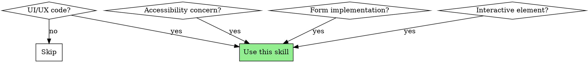

# Web Design Guidelines Validator

## Overview

Validates UI code against Web Interface Guidelines for accessibility, UX patterns, and modern web design best practices. Focuses on WCAG compliance, usability, and responsive design.

**Core principle:** Accessibility is not optional. Every interactive element must be keyboard accessible, properly labeled, and perceivable by all users.

**External reference:** For the latest guidelines, the `web-design-guidelines` skill fetches rules from vercel-labs/web-interface-guidelines. This validator applies those rules systematically.

## When to Use



**Use when:**
- Reviewing React/HTML components with UI elements
- Implementing forms or interactive controls
- Checking accessibility compliance
- Auditing UX patterns
- Building navigation or modals

**Skip when:** Backend code, API routes, non-UI utilities

---

## Quick Reference: Accessibility Checklist

| Element | Required |
|---------|----------|
| Buttons | Accessible name (text or aria-label) |
| Images | Alt text (or aria-hidden if decorative) |
| Form inputs | Associated label (htmlFor/id) |
| Icons in buttons | aria-hidden="true" on icon |
| Links | Descriptive text (not "click here") |
| Modals | Focus trap, aria-modal, close on Escape |
| Loading states | aria-busy, aria-live for updates |

---

## WCAG 2.1 AA Requirements

### Color Contrast

| Element | Minimum Ratio |
|---------|---------------|
| Normal text (<18px) | 4.5:1 |
| Large text (>=18px bold or >=24px) | 3:1 |
| UI components | 3:1 |
| Focus indicators | 3:1 |

### Touch Targets

Minimum 44x44 CSS pixels for all interactive elements (WCAG 2.5.5).

```css
/* Minimum touch target */
.interactive {
  min-height: 44px;
  min-width: 44px;
}
```

### Focus Visibility

All interactive elements must have visible focus indicators.

```css
/* Never do this */
*:focus { outline: none; }

/* Do this instead */
:focus-visible {
  outline: 2px solid var(--focus-color);
  outline-offset: 2px;
}
```

---

## Critical Patterns

### Accessible Buttons

```tsx
// ❌ Missing accessible name
<button><XIcon /></button>

// ✅ Accessible button
<button aria-label="Close">
  <XIcon aria-hidden="true" />
</button>
```

### Form Labels

```tsx
// ❌ Placeholder as label
<input placeholder="Email" />

// ✅ Proper label association
<label htmlFor="email">Email</label>
<input id="email" type="email" autoComplete="email" />
```

### Semantic HTML

```tsx
// ❌ Div as button
<div onClick={handleClick} className="button">Click</div>

// ✅ Real button
<button onClick={handleClick}>Click</button>
```

### Focus Trapping in Modals

```tsx
// ❌ Focus escapes modal
<div className="modal">{content}</div>

// ✅ Focus trapped in modal
<Dialog
  open={isOpen}
  onClose={close}
  aria-labelledby="dialog-title"
>
  <h2 id="dialog-title">Modal Title</h2>
  {content}
</Dialog>
```

### Loading States

```tsx
// ❌ No loading indication
{data && <List items={data} />}

// ✅ Skeleton loader with aria-busy
<div aria-busy={isLoading}>
  {isLoading ? <ListSkeleton /> : <List items={data} />}
</div>
```

### Error States

```tsx
// ❌ Silent failure
{error && <p className="error">{error}</p>}

// ✅ Announced error with recovery
{error && (
  <div role="alert" aria-live="assertive">
    <p>{error.message}</p>
    <button onClick={retry}>Try again</button>
  </div>
)}
```

---

## Anti-Patterns to Detect

| Anti-Pattern | Issue | Fix |
|--------------|-------|-----|
| `outline: none` | Removes focus visibility | Use `:focus-visible` |
| `<div onClick>` | Not keyboard accessible | Use `<button>` |
| Placeholder-only inputs | No persistent label | Add `<label>` |
| Color-only indicators | Inaccessible to colorblind | Add icon/text |
| Tiny touch targets | Hard to tap on mobile | Min 44x44px |
| Auto-playing media | Disruptive | Require user action |
| Focus not trapped in modal | Focus escapes | Use focus trap |

---

## Review Checklist

When validating UI code:

### Accessibility
- [ ] All interactive elements have accessible names
- [ ] All images have alt text (or aria-hidden)
- [ ] All form inputs have associated labels
- [ ] Color contrast meets WCAG AA (4.5:1 / 3:1)
- [ ] Focus is visible on all interactive elements
- [ ] Keyboard navigation works (Tab, Enter, Escape)

### Interactivity
- [ ] Touch targets are at least 44x44px
- [ ] Buttons are `<button>`, links are `<a>`
- [ ] Focus is trapped in modals
- [ ] Escape closes modals/dropdowns

### States
- [ ] Loading states are indicated
- [ ] Error states are announced (role="alert")
- [ ] Disabled states are clear
- [ ] Empty states provide guidance

### Responsive
- [ ] Works at 320px viewport
- [ ] Content reflows without horizontal scroll
- [ ] Touch targets larger on mobile

---

## Severity Guide

- 🔴 **CRITICAL**: Missing keyboard access, no accessible name, focus trap broken
- 🟠 **HIGH**: Poor contrast, small touch targets, missing labels, div as button
- 🟡 **MEDIUM**: Missing loading states, no error recovery, inconsistent focus styles
- 🟢 **LOW**: Missing hover states, suboptimal animations
